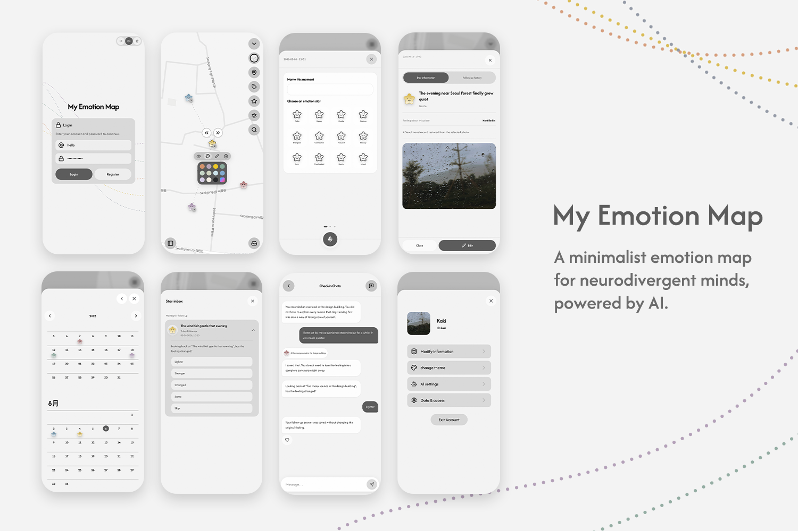

# My Emotion Map

My Emotion Map is a local-first web application for recording emotional moments together with places, dates, notes, and images. It combines a map, calendar, follow-up system, grounded AI chat, private cloud synchronization, and optional MCP access.

The application is designed so that a record does not need to be complete before it is useful. Emotions may remain unknown, reminders may be ignored, and later reflections are stored separately from the original record.

[Live demo](https://kakizzzzz.github.io/My-Emotion-Map/) · [Architecture](docs/ARCHITECTURE.md) · [Security](docs/SECURITY.md)



## Core workflow

### 1. Discover and place

A moment can be created in several ways:

- drag a new star directly onto the map;
- use the current browser location;
- enter latitude and longitude;
- import GPS and capture-time metadata from a photo.

Stars can be moved, recolored, searched, grouped into ordered paths, copied as coordinates, and opened in Apple Maps, Google Maps, Amap, or Baidu Maps with the coordinate conversion required by each provider.

The map offers light, dark, and aerial styles. Text search runs against the signed-in user's local records rather than a third-party place-search service. Map attribution remains visible for OpenFreeMap, OpenMapTiles, OpenStreetMap, and VersaTiles data where applicable.

### 2. Record

Each star links to an emotion note. A note may contain:

- a user title or an optional AI-assisted title;
- a place name;
- an emotion or an explicit unknown value;
- intensity and place-rating information;
- guided answers, custom questions, and free text;
- typed or browser speech-recognition input;
- a private stored image;
- consent for a future follow-up.

Users can save a small record without completing every field. The data model does not infer an emotion when the user leaves it unknown.

### 3. Review

Saved moments can be reopened from either the map or the calendar. The calendar groups records by their stored local date, while the map preserves the spatial relationship between records.

Local search ranks matches from the user's own titles, places, note text, and related record fields. Opening a result returns to the corresponding star without sending the search query to an external geocoder.

### 4. Revisit

A note can schedule a future follow-up using the user's configured intervals. Follow-ups move through queued, active, answered, or skipped states.

Only one due follow-up is promoted to the active conversation at a time. Additional due items remain available through the Star Inbox instead of producing parallel interruptions. An answer records whether the feeling is lighter, stronger, different, the same, or skipped. A completed revisit is stored as a separate entity and does not replace the original emotion.

The scheduler rechecks when the page regains focus, becomes visible, or is restored from browser history. Long delays are divided into safe browser-timer intervals so a follow-up is not abandoned by the maximum timeout limit.

### 5. Notice an older nearby star

While the application is visible and receiving acceptable browser-location samples, it can detect proximity to eligible older stars whose notes have follow-up consent enabled.

The implementation rejects stale, inaccurate, or invalid location samples; uses separate entry and exit radii; records only observed transitions; and applies per-star and global cooldowns. It does not claim that a user was away unless a previous far transition was actually observed.

This is foreground web behavior. It is not presented as continuous native background tracking.

### 6. Reflect with AI

The built-in chat can answer questions using the user's authorized formal Emotion Map records. Draft notes, unfinished records, inbox drafts, demo data, and unsupported future schemas are excluded from evidence selection.

The server, rather than the browser, chooses the evidence plan. It validates record ownership, dates, numbers, evidence references, unknown-emotion semantics, diagnostic language, unsupported causal claims, personality inference, and unsolicited advice before returning a response.

Public references shown in the interface are reconstructed from authorized records by the server. Model output cannot silently modify a note, replace an original emotion, or store a speculative interpretation as fact.

## Time and emotion semantics

Moments and notes carry explicit temporal fields rather than relying only on a JavaScript timestamp:

- local date and local time;
- optional UTC occurrence time;
- optional IANA time zone;
- optional UTC offset;
- minute, date-only, or unknown precision;
- source information such as user input, device creation, photo EXIF, or legacy data.

This permits the application to preserve a user's wall time without inventing a time zone that was never known.

Emotion values are nullable. Unknown is a stored state, not a placeholder that the application later converts into a guessed emotion. Original moments, follow-up responses, and later revisit records remain separate in the data model.

## Photo handling

### GPS and capture metadata

Photo import reads available GPS coordinates and capture time in the browser. When valid coordinates exist, the application creates a linked star and draft note at that location and preserves the source and available capture-time metadata.

A signed-in user can store a note image in the private `emotion-note-images` Supabase Storage bucket. Records store the owner-scoped path and bounded metadata rather than a public image URL. Display access uses temporary signed URLs.

Uncommitted uploads are removed when an editor closes, replaced uploads are scheduled for cleanup, and deletion retries are handled separately from the note mutation.

### Optional photo assistance

Photo assistance is separate from private image storage. Before a selected image is sent to the AI function, the browser resizes it to a bounded size, paints it into a new canvas, and exports a JPEG without the original EXIF metadata.

The Edge Function independently validates the file type, byte size, dimensions, and absence of an EXIF marker. It receives no coordinates, heart-rate data, record history, or unrelated workspace data. Its output is limited to a factual scene-title suggestion and up to two optional questions. Failure does not block creation of the GPS-based record, and a late result cannot overwrite a title the user has already edited.

## Local-first persistence and cloud synchronization

The browser workspace remains usable as local application state. When a configured account is signed in, normalized owner-scoped entities synchronize with the dedicated Supabase project.

Synchronization is mutation-based rather than repeated whole-workspace replacement:

1. local changes are normalized and converted into entity mutations;
2. mutations are written to an account-isolated IndexedDB outbox;
3. the exact in-flight batch is persisted before transmission;
4. the server applies the batch atomically against an expected dataset revision;
5. the client loads the resulting changes and acknowledges the durable batch.

The server RPC validates sensitive keys, coordinates, dates, references, entity limits, and the caller's current revision before incrementing `dataset_revision` once for the batch. Authenticated clients cannot directly insert, update, or delete the normalized business tables.

The client retries durable in-flight work after response loss or temporary network failure. Focus, page restoration, online events, visibility changes, and same-account `BroadcastChannel` messages trigger rechecks without discarding pending local edits.

If the remote revision advances while local mutations are pending, the application reconciles confirmed and unconfirmed operations. Unsafe overlap creates a recovery bundle instead of silently choosing a winner. Conflict actions preserve recovery data before loading cloud state, keeping local state, or applying a safe merge.

Deleted entities use tombstones retained for seven complete days, and entity history is bounded to 20 before-images per entity.

## Accounts and normalized cloud data

Supabase Auth owns sessions and passwords. Each signed-in account loads only its own workspace under row-level security.

The live cloud model stores normalized owner-scoped entities and a revision row. The historical `app_states` JSON table is retained only as a service-role migration archive: authenticated clients and runtime Edge Functions cannot use it as live storage, and new writes are rejected.

Profile preferences such as language, display name, AI settings, follow-up intervals, and theme settings are coordinated separately from formal emotion records but participate in account-aware synchronization where defined.

Deleting all workspace data immediately clears the local workspace and synchronizes permanent workspace deletion to the cloud. It does not delete the Supabase Auth account.

## Export, backup, and import

The settings interface provides two different export paths.

### Readable report

Users can export all formal records or select a local-date range. This output is intended for reading rather than complete restoration.

### Complete JSON backup

The complete backup uses stable serialization and a SHA-256 checksum. It includes the restorable workspace, conversations, follow-ups, revisits, theme, avatar, and account preferences supported by the backup schema.

It excludes passwords, sessions, provider credentials, Supabase tokens, MCP tokens, shortcut tokens, device location, mutation sequence data, recovery copies, and other secret or device-specific fields.

Import validates the version, checksum, canonical fields, unique identifiers, and cross-entity references before changing local state. A future schema version stops the import. Valid backups can be merged with the current workspace or used to replace it. Same-ID differences preserve the local entity and are recorded for recovery rather than being silently overwritten.

## Built-in AI boundary

The browser sends the current question, language, conversation identifier, and known cloud revision. It cannot choose the provider model, system prompt, evidence set, token budget, or source plan.

The chat Edge Function authenticates the account and reads the same owner-scoped normalized snapshot used by synchronization. It selects a bounded set of formal local records and returns grounded references, limitations, optional clarification choices, and separately marked external evidence when applicable.

Provider credentials exist only in Edge Function secrets. Provider error bodies and raw generated drafts are not returned to the browser or written to logs. AI quotas are claimed atomically per authenticated user: five photo-assistance requests and ten chat requests per hour.

## Optional My Life Memory input connection

My Life Memory is a separate application. This repository does not modify or deploy it.

A user may explicitly connect the official read-only My Life Memory MCP to built-in Emotion Map chat. The browser submits a user-created token once; it cannot submit an arbitrary endpoint, manifest, model, evidence plan, or token budget.

Before storing the connection, the server verifies MCP initialization, the expected server identity, read-only annotations, and the complete canonical nine-tool manifest fingerprint. The token is encrypted with AES-GCM in an owner-scoped row. Browser code can read connection status but has no database grant to the ciphertext or initialization vector.

Ordinary Emotion Map questions remain local. The external connection is used only for an explicit My Life Memory, cross-memory, route, or photo request. Returned tool text is treated as untrusted data, bounded by call and byte limits, labelled separately, and excluded from local repeated-pattern counts and local ownership links. Disconnecting deletes the encrypted connection row.

See [My Life Memory connection](docs/MY_LIFE_MEMORY_CONNECTION.md) for the exact boundary and current verification status.

## Emotion Map MCP output

Emotion Map also exposes its own optional outbound MCP interface. This is separate from the My Life Memory input connection.

### Read-only endpoint

An owner-issued `output` token has the `records:read` scope. The read-only manifest contains seven tools:

- `research_emotion_context`
- `search_emotion_records`
- `list_emotion_locations`
- `get_location_emotion_context`
- `get_day_emotion_context`
- `summarize_emotion_range`
- `export_emotion_report`

The default manifest contains no coordinate, health, image, deep-link, or write tool. Drafts, unfinished stars, inbox items, demo data, and unknown future snapshot schemas are excluded or rejected.

### Proposal endpoint

A separate endpoint and explicitly issued `action` token may expose three proposal tools. These tools can only queue idempotent proposals. They cannot directly change an Emotion Map record.

Applying a proposal still requires confirmation inside the application. The flow checks the target fingerprint and expected revision, stores a recovery journal containing normalized mutations and before-entity hashes, and marks the operation applied only after the resulting workspace revision has synchronized. Revision or fingerprint drift stops the operation.

Both MCP endpoints use authenticated stateless JSON-RPC POST, bounded batches, protocol negotiation, Origin allowlists for browser callers, hashed bearer tokens, expiry and revocation, owner-filtered queries, and `last_used_at` updates.

See [Emotion Map MCP](docs/EMOTION_MAP_MCP.md) for schemas, deployment details, and remaining release gates.

## Security model

The principal boundaries are:

- browser code contains only `VITE_SUPABASE_URL` and `VITE_SUPABASE_PUBLISHABLE_KEY`;
- service-role keys, model credentials, connection-encryption keys, continuation secrets, and fixed MCP configuration remain in Edge Function secrets;
- normalized cloud rows are owner-scoped by RLS;
- authenticated clients write business data only through the revision-checked mutation RPC;
- private images use owner-scoped Storage paths and temporary signed URLs;
- raw MCP tokens are accepted only through bearer headers, hashed before lookup, and never persisted in browser storage;
- the My Life Memory credential is encrypted server-side and is not readable by the frontend;
- external MCP text is treated as untrusted input and cannot override the model policy;
- backup schemas exclude credentials and device-specific synchronization state.

The service is designed to prevent cross-account access and accidental credential exposure. Deployment still requires the verification procedures in [Security](docs/SECURITY.md), including two-account RLS tests, retry and conflict tests, provider-failure tests, source/build credential scans, real iPhone photo tests, and MCP token expiry and revocation checks.

## Frontend architecture

The frontend follows a one-way dependency direction:

```text
main
  -> App
    -> app chrome and feature screens
      -> repositories, browser services, i18n, and shared UI
        -> domain types and seed data
```

`src/App.tsx` owns cross-screen composition and persisted state coordination. Feature folders own their markup and temporary UI state. Browser APIs are isolated behind hooks or services. Cross-feature behavior is coordinated through props and app-level state rather than deep imports between sibling features.

Primary folders:

```text
src/
  App.tsx
  app/                    shared coordinators, repositories, and app chrome
  domain/                 validation, retrieval, storage, and mutation rules
  features/
    map/
    calendar/
    notes/
    chat/
    inbox/
    settings/
    location/
  services/               Supabase, AI, image, MCP, and synchronization clients
  types.ts                shared domain types
  i18n.ts                 Chinese, English, and Korean copy and locale rules
supabase/
  functions/              authenticated Edge Functions and shared server code
  migrations/             normalized storage, RLS, RPC, quota, and MCP schema
scripts/                  source-size and import-boundary checks
tests/                    unit, component, architecture, and browser tests
```

Import direction and source-size contracts are enforced by `npm run check:architecture`.

## Technology

- React 19 and React DOM
- TypeScript 5.7
- Vite 6
- MapLibre GL and react-map-gl
- Supabase Auth, Postgres, Row Level Security, private Storage, RPC, and Edge Functions
- exifr for photo GPS and capture metadata
- Motion for interface transitions and reduced-motion behavior
- Lucide React and react-colorful
- Vitest, Testing Library, jsdom, Playwright, and axe-core

## Local development

Node.js 20 or newer is recommended.

```bash
npm install
npm run dev
```

Open `http://127.0.0.1:3000`.

The frontend cloud configuration uses:

```bash
VITE_SUPABASE_URL=https://your-project-ref.supabase.co
VITE_SUPABASE_PUBLISHABLE_KEY=your-publishable-key
```

Without valid values, the Supabase client remains unconfigured. Secret provider and service-role values must not use a `VITE_*` name and must never enter browser code.

For deployment under a project path, set:

```bash
VITE_APP_BASE_PATH=/your-project-path/
```

## Validation

```bash
npm run typecheck
npm run lint
npm test
npm run check:architecture
npm run build
npm run test:e2e
```

Combined commands:

```bash
npm run check
npm run check:all
```

`check` runs TypeScript validation for the frontend and Edge Functions, ESLint with zero warnings, unit and component tests, source-size and import-boundary checks, and the production build.

`check:all` additionally runs the Playwright browser suite, including mobile Chromium and iPhone WebKit flows. Accessibility checks use axe-core where defined.

## Deployment

The repository includes a GitHub Pages workflow for the `main` branch. It installs dependencies, builds with the project base path and public Supabase variables, uploads `dist`, and deploys through GitHub Pages.

Edge Functions, database migrations, RLS policies, Storage configuration, quotas, MCP endpoints, and required secrets belong to the dedicated My Emotion Map Supabase project and are not created by the static Pages deployment.

## Documentation

- [Frontend architecture](docs/ARCHITECTURE.md)
- [Security boundary](docs/SECURITY.md)
- [Emotion Map MCP](docs/EMOTION_MAP_MCP.md)
- [My Life Memory connection](docs/MY_LIFE_MEMORY_CONNECTION.md)
- [Map data and attribution](docs/MAP_DATA_LICENSES.md)

## License

This repository currently does not include an open-source license. Public repository visibility permits source review but does not grant an open-source reuse licence.