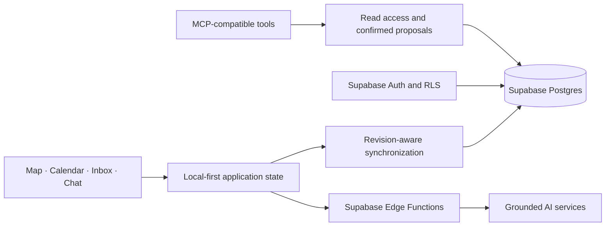

# My Emotion Map

My Emotion Map is a local-first web application for recording emotional moments together with places, dates, notes, and images. It provides map and calendar views, scheduled follow-ups, AI-assisted reflection, and optional MCP access.

[Live demo](https://kakizzzzz.github.io/My-Emotion-Map/) · [Architecture](docs/ARCHITECTURE.md) · [Security](docs/SECURITY.md)

## Features

- Place stars directly on the map, enter coordinates, or import GPS and capture information from a photo.
- Create short or detailed records with typed or voice input.
- Review records through map and calendar views.
- Schedule future follow-ups for saved records.
- Store additional follow-up messages in the Star Inbox while keeping one active conversation at a time.
- Compare past and present records through AI-assisted conversations.
- Configure language, appearance, AI preferences, and data access.
- Connect external MCP-compatible tools through optional, permission-controlled access.

## Data behavior

- Records may remain incomplete.
- Unknown emotions are preserved as unknown.
- Later reflections are stored separately from the original record.
- Reminders are optional and can be ignored.
- Local changes are synchronized through a revision-aware process.
- Signed-in account data is isolated through Supabase Auth and row-level security.

## AI and MCP behavior

AI responses are grounded in records authorized by the user. The system distinguishes between stored information, missing information, and model-generated interpretation. AI responses do not overwrite original records or store speculative conclusions as facts.

The optional MCP interface is read-only by default. Operations that could modify application data create proposals that require confirmation inside My Emotion Map before they are applied.

## Architecture



Browser code contains only the public Supabase URL and publishable key. Model credentials and service-role credentials are stored in Edge Function secrets.

## Technology

- React 19, TypeScript, and Vite
- MapLibre GL and react-map-gl
- Supabase Auth, Postgres, Storage, and Edge Functions
- exifr for photo metadata extraction
- Motion and Lucide React
- Vitest, Testing Library, Playwright, and axe-core

## Run locally

```bash
npm install
npm run dev
```

Open `http://127.0.0.1:3000`.

For deployment under a project path, set `VITE_APP_BASE_PATH` to the public base path.

## Validation

```bash
npm run check
npm run check:all
```

`check` runs TypeScript, ESLint, unit and component tests, architecture checks, and the production build. `check:all` also runs the mobile Chromium and iPhone WebKit flows.

## Documentation

- [Architecture](docs/ARCHITECTURE.md): state and module ownership
- [Security](docs/SECURITY.md): secrets, RLS, synchronization, and AI grounding
- [Emotion Map MCP](docs/EMOTION_MAP_MCP.md): external access and confirmed actions
- [My Life Memory connection](docs/MY_LIFE_MEMORY_CONNECTION.md): optional read-only input connection
- [Map data and licenses](docs/MAP_DATA_LICENSES.md): map sources and attribution
