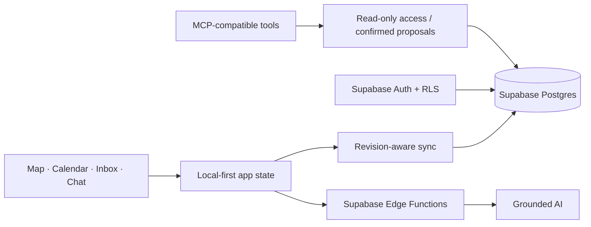

<div align="center">

# My Emotion Map

**A minimalist emotion map for neurodivergent minds, powered by AI.**

[Live demo](https://kakizzzzz.github.io/My-Emotion-Map/) · [Devpost](https://devpost.com/software/my-emotion-map) · [Architecture](docs/ARCHITECTURE.md) · [Security](docs/SECURITY.md)

</div>


## A quieter way to understand emotional patterns

My Emotion Map is a local-first tool for connecting feelings with places, dates, memories, and images. It brings discovery, recording, review, and reflection into one continuous experience without turning emotional awareness into another task to maintain.

There are no streaks, positivity scores, forced completion, or penalties for interrupted use. A record can stay small. A feeling can remain unknown. A later reflection never overwrites the original moment.

## Product flow


- **Discover:** Place a star directly on the map, enter coordinates, or import GPS and capture information from a photo.
- **Record:** Type, use voice input, add context, or skip anything the user does not want to provide.
- **Review:** Return to past moments through both the map and calendar.
- **Revisit:** Schedule a future check-in or receive an optional reminder when returning near an older star.
- **Reflect:** Use grounded AI to compare past and present records without diagnosis or invented certainty.
- **Control:** Manage appearance, AI preferences, data access, and optional MCP connections inside the application.

## Designed without pressure

- No streaks or completion metrics
- No rewards for so-called positive emotions
- No punishment for interrupted use
- Unknown emotions remain unknown
- Original records remain separate from later reflections
- Only one follow-up stays active; additional messages wait in the Star Inbox
- Every reminder is optional and can be ignored

## AI, with boundaries

AI responses are grounded in records the user has authorized. The system distinguishes between known information, missing information, and speculation. It does not diagnose the user, rewrite the user’s original record, or silently store an interpretation as fact.

The optional MCP interface is read-only by default. Any action that could modify data becomes a proposal and requires confirmation inside My Emotion Map before it can be applied.

## Architecture at a glance



Account data is isolated between signed-in users. Browser code contains only the public Supabase URL and publishable key; model credentials and service-role credentials stay in Edge Function secrets.

## Built with

React 19 · TypeScript · Vite · MapLibre GL · react-map-gl · Supabase Auth, Postgres, and Edge Functions · exifr · Motion · Lucide React · Vitest · Testing Library · Playwright · axe-core

## Run locally

```bash
npm install
npm run dev
```

Open `http://127.0.0.1:3000`.

For deployment under a project path, set `VITE_APP_BASE_PATH` to the public base path.

## Validation

```bash
npm run check
npm run check:all
```

`check` runs TypeScript, ESLint, unit and component tests, architecture checks, and the production build. `check:all` also runs the mobile Chromium and iPhone WebKit flows. CI repeats both groups.

## Documentation

- [Architecture](docs/ARCHITECTURE.md): state and module ownership
- [Security](docs/SECURITY.md): secrets, RLS, synchronization, and AI grounding
- [Emotion Map MCP](docs/EMOTION_MAP_MCP.md): read-only external access and confirmed actions
- [My Life Memory connection](docs/MY_LIFE_MEMORY_CONNECTION.md): fixed read-only input connection
- [Map data and licenses](docs/MAP_DATA_LICENSES.md): map sources and attribution
